# Nonlinear Chirp Spread Spectrum: A Narrative Walkthrough

This is a companion to `PAPER.md`, written for a reader who already knows
what LoRa is and wants to understand *why* each result in this project is
true, not just look one up. The math is the same and equally rigorous —
every proof here is the same proof — but the order is different: each idea
is motivated in plain language before the equation that formalizes it, and
each chapter ends by handing the next chapter its problem.

The story in one line: define the waveform, show why conventional LoRa
detection fails on it, introduce correlation as the fix, make correlation
computationally practical, ask why you'd want a nonlinear trajectory in the
first place (Doppler), then use the trajectory itself to track where the
signal actually is.

```
1. The Chirp Model
   "What are we transmitting?"
        │
        ▼
2. Why the Standard LoRa Decoder Needs a Linear Chirp
   "Why doesn't normal LoRa demodulation work anymore?"
        │
        ▼
3. A Decoder That Works for Any Chirp
   "Can correlation solve the problem?"
        │
        ▼
4. The Fast Decoder: The Correlation Theorem
   "Can we make correlation computationally practical?"
        │
        ▼
5. Two Doppler Models, and Why They Give Different Answers
   "Why might a nonlinear trajectory be useful in the first place?"
        │
        ▼
6. Dual-Edge Frequency Tracking
   "Once we know the trajectory, how do we track where the
    received signal actually is relative to it?"
```

---

## 1. The Chirp Model

A chirp is a signal whose instantaneous frequency changes with time. In
conventional LoRa, that frequency changes *linearly*: a straight ramp from
the bottom of the channel to the top. This project generalizes the
frequency trajectory so it can follow an arbitrary shape instead of a
straight line:

$$
f(t) = f_0 + B \cdot g(t/T)
$$

$g$ is the shape being varied. $g(u)=u$ reproduces the linear ramp, plain
LoRa. Any other $g$ — curved, S-shaped, whatever — produces a curved
frequency trajectory instead. $g$ is normalized so $g(0)=0$ and $g(1)=1$,
which just means the trajectory always starts at the bottom of the band
and ends at the top, no matter its shape in between. Here's every shape
this project tests, side by side, including hyperbolic FM (HFM), the
shape Chapter 5 comes back to for its Doppler properties:

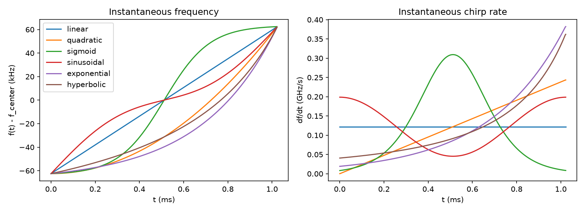

The left panel is $f(t)$ itself — this is what "the trajectory" actually
looks like. The right panel is $df/dt$, the *chirp rate*: `linear`'s rate
is a flat line (constant, by construction), while every other shape's rate
visibly changes over the symbol. That difference is what breaks the
standard FFT-bin trick in Chapter 2.

Frequency integrates to phase, and phase exponentiates to the actual
transmitted waveform:

$$
\phi(t) = 2\pi\int_0^t f(\tau)d\tau, \qquad s(t) = e^{j\phi(t)}
$$

A symbol is encoded as a different cyclic shift of the *same* reference
chirp — not $M$ unrelated waveforms, one waveform shifted to $M$ different
starting points. That matters because it means the receiver's job is
never "which of $M$ independent signals is this?" It's always "which
shift of *one* signal is this?" That reframing is what makes Chapters 3
and 4 possible.

$$
s_m[n] = s[(n+\tau_m)\bmod N], \qquad \tau_m = \mathrm{round}(mN/M)
$$

Under the discrete-time representation used in this work, each symbol is a
cyclic sample shift of a common reference waveform, exactly as written
above — a description of the model in this project, not a claim about the
internals of any particular commercial LoRa chipset.

---

## 2. Why the Standard LoRa Decoder Needs a Linear Chirp

This chapter explains why the rest of the project needs to exist.

The conventional LoRa receiver multiplies the received chirp by the
conjugate of a reference chirp, "dechirping":

$$
d(t) = r(t) \cdot \overline{s(t)}
$$

Complex multiplication adds phases, so multiplying by a conjugate
*subtracts* the reference's phase:

$$
e^{j\phi_r(t)} \cdot e^{-j\phi_s(t)} = e^{j[\phi_r(t)-\phi_s(t)]}
$$

In the ideal case the received signal really is symbol $m$'s waveform,
$\phi_r(t) = \phi(t+\tau_m)$, so the dechirped signal's *instantaneous
frequency* — its rate of phase change — is

$$
f(t+\tau_m) - f(t)
$$

For a linear chirp, $f(t) = f_0 + kt$:

$$
f(t+\tau) - f(t) = k(t+\tau) - kt = k\tau
$$

A constant. A signal whose frequency doesn't change with time is a pure
tone, and a pure tone's FFT is one sharp spike, not a spread-out mess. The
whole standard-LoRa demodulator rests on this chain:

```
linear chirp → dechirp → constant frequency → tone → FFT → one strong bin → symbol
```

The shift $\tau_m$ — the symbol — survives the entire chain and comes out
the other end as *which bin lit up*. It's worth pinning down exactly when
that's true rather than taking it for granted.

**Claim.** $f(t+\tau)-f(t)$ is constant in $t$ for every $\tau$ if and only
if $f$ is affine, $f(t) = f_0+kt$.

*Proof.* ($\Leftarrow$) Shown above. ($\Rightarrow$) If $f(t+\tau)-f(t)=c(\tau)$ for every $t$, differentiate both sides with respect to $t$: $f'(t+\tau)-f'(t)=0$ for all $t,\tau$, so $f'$ is constant, so $f$ is affine. $\blacksquare$

So the FFT-bin trick isn't a general property of chirps. It's a one-off
algebraic coincidence that only the straight line has.

For a curved trajectory, the frequency doesn't advance at a constant rate
— it's steeper in some places, shallower in others. Shifting a *curved*
trajectory in time doesn't produce a constant frequency difference,
because how much the curve has moved up or down over a given time shift
depends on how steep it was at that particular point. So after
dechirping, the residual signal's frequency keeps changing with time; it
never settles into a single tone:

```
nonlinear chirp → dechirp → frequency still changes → not a tone
                → FFT energy spreads → no single bin reliably identifies the symbol
```

This is the idea everything from here on depends on. Here it is
concretely, on the same symbol (33), decoded via `fft_demod` for linear
vs. hyperbolic:

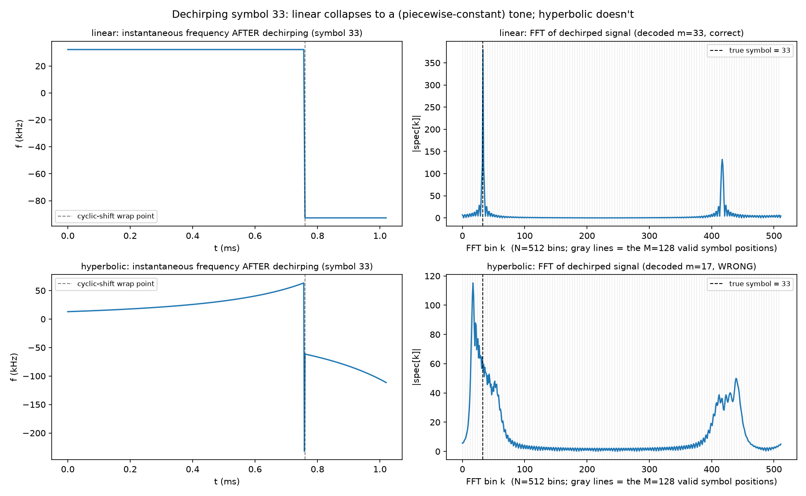

The left-hand panels are the frequency *after* dechirping, not the raw
transmitted chirp — the raw linear chirp does sweep, as Chapter 1's plot
shows. Dechirping is precisely the operation that cancels that sweep, so
"flat" here isn't a failure to plot the sweep; it's the effect being
demonstrated. Multiplying by the reference's conjugate turns a moving
frequency into a nearly constant one, which is the entire reason a single
FFT can read off a bin index for linear chirps. Top row: the dechirped
frequency sits at one constant value, steps to a *second* constant value
at the wrap point (differing by exactly the swept bandwidth `B`, 125 kHz
here), and stays there. Two flat pieces, not one — but each piece by
itself is still a tone, which is why the FFT on the right still lands one
sharp spike at bin 33 rather than two separate ones.

Bottom row, hyperbolic: the curve after the wrap descends because
hyperbolic's own chirp *rate* is increasing over time (visible in Chapter
1's right-hand `df/dt` panel — hyperbolic's rate climbs fastest near the
end of the sweep). After the wrap, the dechirped signal compares a late,
steep part of the trajectory against an early, shallow part, and that gap
widens as time goes on. That's the downward curve, checked here against
the exact closed-form `f(t+τ)-f(t)`, not just the noisier numerical
derivative. Either way, the frequency never settles into a single value,
so the FFT on the right smears across many bins instead of concentrating
in one, and `fft_demod`'s `argmax` confidently returns the wrong symbol
(17, not 33) — not "less accurate," actually wrong, on a noiseless signal.
That's the exact failure
`tests/test_receiver.py::test_fft_demod_fails_for_properly_embedded_hyperbolic_chirp`
confirms directly rather than just arguing for it.

One more thing the figure shows: the FFT panels run to 512, not 128.
`SF=7` gives `M=128` possible *symbols*, but each symbol is sampled at
`N=512` points (4x oversampling — a standard receiver design choice this
project keeps, not something specific to nonlinear trajectories). The FFT
operates on those 512 time-domain samples, so it has 512 bins; only 128 of
them (the thin gray lines) are actual valid symbol positions the decoder
ever looks at.

---

## 3. A Decoder That Works for Any Chirp: Brute-Force Correlation

If dechirping no longer produces a tone, we need a different way to
figure out which symbol was transmitted.

The natural question is: which candidate waveform looks most like the
received waveform? That's correlation — a way of measuring how well two
signals line up.

$$
\mathrm{score}_m = \sum_{n=0}^{N-1} \overline{s_m[n]} \cdot r[n], \qquad \hat m = \arg\max_m |\mathrm{score}_m|
$$

Because every candidate is a cyclic shift of the same reference waveform
(Chapter 1), this has a concrete meaning: try every possible shift, score
how well each one matches the received signal, and keep the shift that
matches best.

This works for *any* trajectory, curved or straight — there's no
shift-invariance coincidence being relied on here, just a direct
comparison. The catch is cost: $M$ separate length-$N$ sums, $O(NM)$ work
per received symbol. Correlation solves the detection problem, but
calculating every possible correlation separately is expensive, and that
expense is exactly what Chapter 4 removes.

(Implementation: `nlfsc_lora/receiver.py::matched_filter_bank_demod`.)

---

## 4. The Fast Decoder: The Correlation Theorem

Chapter 3 showed that correlation can detect any chirp shape, but doing
it required $M$ separate correlations. Here's the fact that changes that:
all $M$ of those candidate waveforms are shifts of the *same* waveform, so
the $M$ scores were never $M$ unrelated numbers in the first place — they
are $M$ samples of one circular correlation function. Define that
function for *every* possible shift $l$, not just the $M$ ones that
correspond to real symbols:

$$
C[l] = \sum_{n=0}^{N-1} s[n] \cdot \overline{r[(n-l)\bmod N]}
$$

Instead of asking for one score at a time, this asks for the correlation
at every possible shift simultaneously. The question is whether $C[l]$
can actually be computed that way cheaply, and it can, via the
correlation theorem. Let $S[k]$ and $R[k]$ be the ordinary DFTs of $s[n]$
and $r[n]$:

$$
C[l] = \mathrm{IDFT}\big(S[k] \cdot \overline{R[k]}\big)[l]
$$

*(Full derivation and proof of this theorem, plus the reindexing argument
that connects it exactly to $\mathrm{score}_m$, are in `PAPER.md` §4 —
kept there rather than duplicated here, since the point of this document
is the narrative, not re-deriving the same algebra twice.)*

This is the line of code that does the work:

```python
corr = np.fft.ifft(base_fft * np.conj(np.fft.fft(rx)))   # C[l] for every l, at once
m_hat = int(np.argmax(np.abs(corr[valid_lags])))          # look up the M known shifts
```

Here's that computation on one actual received symbol (hyperbolic
trajectory, symbol 33, 10 dB SNR). First, the actual waveform being
decoded — the hyperbolic trajectory cyclically shifted to symbol 33, same
style as the Chapter 1 plot but for this one specific symbol instead of
every shape's `m=0` base:

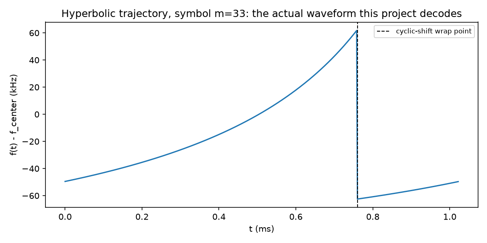

The curve is the same hyperbolic shape from Chapter 1, just started at a
different point and wrapped around — the dashed line marks where the
trajectory's end folds back to its beginning, the "wrap point" Chapter 6
returns to. Now the rest of the computation: `|S[k]|` and `|R[k]|`, the
two FFT magnitudes the code above starts from; what conjugating `R[k]`
actually changes; and `|C[l]|`, the correlation the IFFT recovers from
their product.

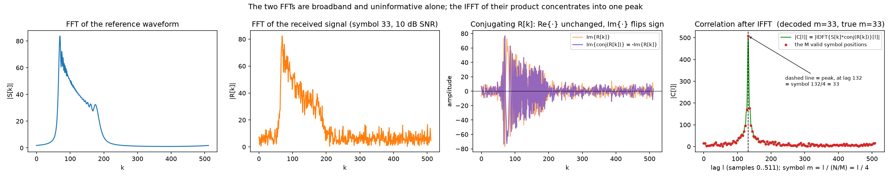

Neither of the first two panels tells you the symbol by itself. Both
spectra are spread across many frequency bins, an unavoidable property of
a chirp, since it sweeps through a wide range of frequencies over the
symbol. The third panel shows what *conjugating* `R[k]` actually does to
it: not much to its magnitude, since `|conj(R[k])| = |R[k]|` always, so a
magnitude plot of it would just repeat the second panel. Conjugation only
touches the imaginary part, flipping its sign (equivalently, it negates
the phase); the real part is untouched. That's what lets the product
`S[k]·conj(R[k])` add up constructively at the one lag where the two
waveforms actually line up, and mostly cancel elsewhere. The fourth panel
is the payoff: multiplying those two spectra together and taking one IFFT
concentrates all of that spread-out energy into a single sharp spike,
sitting exactly at the true shift (dashed line). The red dots are the $M$
positions `τ_m` that actually correspond to real symbols — `argmax` over
just those $M$ points is the whole decoder, and it lands on the correct
one here.

The fourth panel's x-axis is `lag l`, a sample-domain shift (0 to `N-1` =
511 here), not the symbol index directly, so it's easy to misread. The
peak sits at lag 132, not "33" — that's not a discrepancy, it's Chapter
1's `τ_m = round(m·N/M)` formula showing up again: symbol 33's cyclic
shift is `round(33·512/128) = 132` samples, so the peak *is* symbol 33,
expressed in samples instead of symbol index. To go from a peak lag back
to a symbol, divide by `N/M = 4`: `132 / 4 = 33`. The decoder itself never
does that conversion explicitly — `fft_correlation_demod` only ever looks
at `corr[valid_lags]`, an array already indexed `0..M-1` one entry per
symbol, and `argmax` on that array returns the symbol index directly. The
annotation on the plot spells out the same arithmetic for anyone reading
the lag axis by eye.

The mental model for the difference between Chapter 3 and this chapter:

```
Brute force                          FFT correlation

Received                             Received ──→ FFT ──┐
   │                                                     ×
   ▼                                 Reference ─→ FFT ──┘
Compare with shift 0                         │
Compare with shift 1                         ▼
Compare with shift 2                        IFFT
   ...                                       │
Compare with shift M                         ▼
   │                                  ALL shifts at once
   ▼                                         │
Pick largest                                 ▼
                                       Pick largest
```

The right side isn't a mathematical curiosity bolted on for elegance —
it's what turns "check every candidate" from a genuine $O(NM)$ bottleneck
into essentially the cost of three transforms, $O(N\log N)$.

At $SF=7$ ($N=512$, $M=128$): $NM \approx 65{,}500$ versus
$\sim 3N\log_2 N \approx 13{,}800$. Read that comparison carefully, though
— those two numbers are a theoretical operation count, not a timing
measurement. The theoretical complexity predicts substantially less work;
the measured implementation separately provides an approximately
$85\times$ runtime improvement for the tested configuration. The two
figures agree in direction but shouldn't be read as the same number
measured two ways — real timing includes constant factors (library
overhead, caching, memory access patterns) the raw operation count
doesn't capture.

And it's not just faster, it's exactly as correct:
`tests/test_receiver.py::test_fft_correlation_demod_matches_matched_filter_bank_exactly`
checks that this decoder gives the *identical* decision as the
brute-force one from Chapter 3 on every trial, not merely similar
accuracy.

(Implementation: `nlfsc_lora/receiver.py::fft_correlation_demod`.)

Now that every shape has a decoder that's both correct and cheap, a fair
comparison is finally possible: does the trajectory shape itself affect
plain noise tolerance, decoded the same way for everyone?

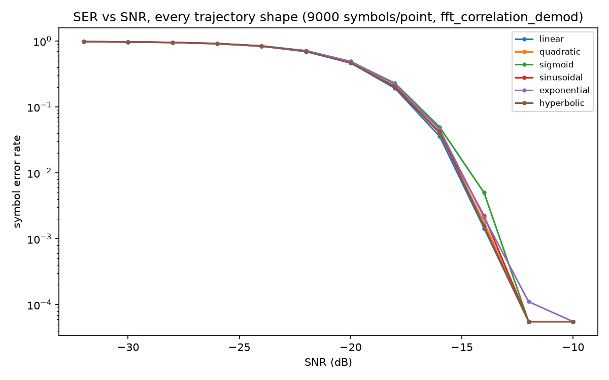

(The x-axis runs from -10 dB down to -32 dB, left to right — read it as a
channel that starts out clean and degrades over time, rather than the
usual "worst to best" waterfall convention.)

Barely. Every shape's curve sits almost on top of the others — `sigmoid`
trails the rest by a small margin near the knee of the curve, but nothing
here is dramatically more or less noise-tolerant than `linear` once the
decoder itself isn't the bottleneck. So curving the trajectory isn't
buying noise tolerance. If it's going to earn its keep, it has to be for
some other reason, which is exactly the question Chapter 5 picks up.

---

## 5. Two Doppler Models, and Why They Give Different Answers

Everything so far has been about detecting a symbol correctly. This
chapter asks why curving the trajectory in the first place might ever
help with that. The answer depends entirely on which kind of Doppler is
actually present, because Doppler can affect a signal in two fundamentally
different ways: it can appear as a frequency offset, or it can act as a
time scaling of the waveform. These aren't two views of the same thing —
they call for different waveform properties, and this project found real
evidence for both being true.

### 5.1 Narrowband Doppler: a frequency offset

$$
r(t) = s(t) \cdot e^{j2\pi f_\Delta t}
$$

This shifts the *entire* frequency trajectory by a constant amount —
every frequency in the sweep moves up (or down) by the same $f_\Delta$:

```
Expected:   100 → 110 MHz
Received:   101 → 111 MHz
```

The frequency changed, but the *shape* of the trajectory didn't — it's
still the same curve, just relabeled. In particular, the *rate* the
frequency is changing at, $df/dt$, is completely unaffected:

$$
\frac{d}{dt}\big[f(t) + f_\Delta\big] = \frac{df}{dt}
$$

That's the idea Chapter 6 is built on: frequency tells us where the
signal is; frequency *rate* tells us whether it's following the expected
trajectory. A frequency reading can be thrown off by Doppler; a rate
reading, for a curved trajectory, can't.

At the correct-symbol level, curving the trajectory doesn't change how
much correlation magnitude a given $f_\Delta$ costs — that loss reduces to
$\left|\int_0^T e^{j2\pi f_\Delta t}dt\right|$, independent of the
trajectory's shape, because $|s(t)|=1$ always. What can differ between
trajectories is confusability with the neighboring symbol, a smaller,
shape-dependent effect:

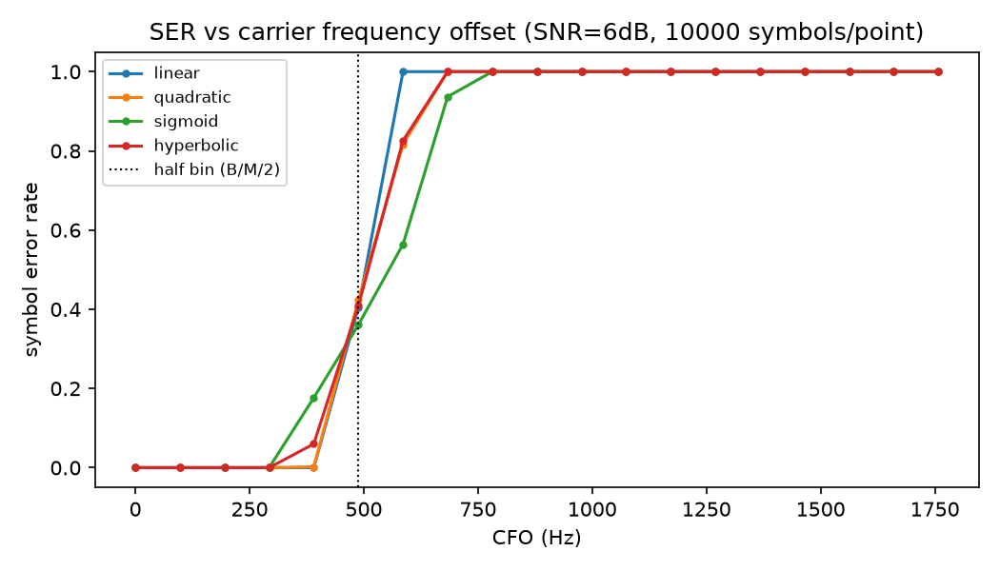

### 5.2 Wideband Doppler: time scaling

A more general, and physically exact, Doppler model isn't a shift at all
— it's a time scaling of the whole waveform:

$$
r(t) = s(\alpha t), \qquad \alpha = 1 \pm v/c
$$

Instead of moving the waveform up or down in frequency, the entire
waveform is compressed or stretched in time. This is where hyperbolic FM
(HFM), the trajectory whose *period*, $1/f(t)$, is linear in $t$, earns
its keep. Before the proof, the meaning: for HFM, time-scaling produces
another copy of the *same* waveform, just shifted in time and rotated by
a constant phase. Nothing about its shape changes; it isn't distorted
into a different waveform the way a straight-ramp chirp is.

$$
f(t) = \frac{f_{\text{low}}}{1-\beta t}, \qquad \phi(t) = -\frac{2\pi f_{\text{low}}}{\beta}\ln(1-\beta t)
$$

**Theorem (exact).** For any $\alpha>0$,
$\phi(\alpha t) = \phi(t-\Delta) + c$, with
$\Delta = \dfrac{1-\alpha}{\alpha\beta}$ and
$c = -\dfrac{2\pi f_{\text{low}}}{\beta}\ln\alpha$.

*Proof.* The identity $1-\beta\alpha t = \alpha\big(1-\beta(t-\Delta)\big)$ holds exactly for that $\Delta$ (expand the right side and collect terms). Apply $-\frac{2\pi f_{\text{low}}}{\beta}\ln(\cdot)$ to both sides of the identity and the claim follows directly. $\blacksquare$

So $s(\alpha t) = e^{jc} \cdot s(t-\Delta)$ — exactly, not approximately,
for the idealized continuous-time waveform. A matched filter built for
the unscaled $s$ still recognizes a Doppler-scaled copy perfectly; the
scaling only moves *where* the peak lands, never how tall it is. A linear
chirp has no such identity: time-scaling it changes its chirp rate
outright into a genuinely different waveform, which is why a linear
chirp's matched-filter response degrades under scaling rather than merely
shifting. HFM loses about 1 dB of peak magnitude across a $\pm10\%$ scale
sweep, versus more than 10 dB for a linear chirp:

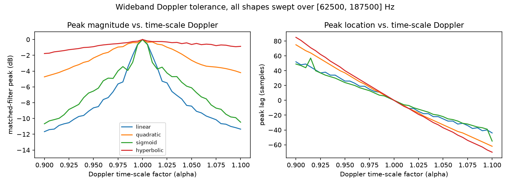

The exactness above is a property of the idealized, unbounded-domain
waveform; a real burst has a finite window, so the shifted copy's support
doesn't line up perfectly with the original observation window at the
edges. That's the real, measured, nonzero loss reported above.

The caveat that matters for the rest of the chapter: HFM has a real
theoretical Doppler advantage, but that doesn't mean HFM automatically
solves Doppler for the complete $M$-ary LoRa receiver. Plugging HFM into
LoRa's own fine-grained, cyclic-shift decoding shows the advantage only
partially surviving — that decoder's sensitivity to a Doppler-induced
*lag*, which turns out to be nearly identical across every trajectory,
sets in before HFM's magnitude-preservation advantage gets a chance to
matter. The single-waveform result is real; it just isn't the whole
story:

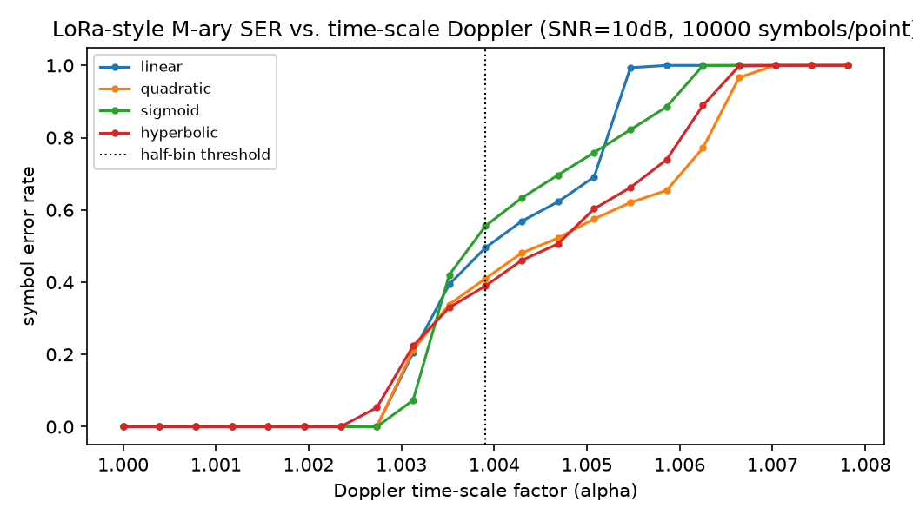

---

## 6. Dual-Edge Frequency Tracking

If the receiver knows what trajectory to expect, how can it tell where
the received signal actually is relative to that trajectory? The
intuition is the same one Chapter 5.1 set up. Suppose the expected signal
sweeps:

```
Expected:   100 → 110 MHz
Measured:   101 → 111 MHz
```

The frequency is off by about 1 MHz. But the *rate of change* — how fast
the frequency is climbing — is the same in both cases. That single
observation is the conceptual heart of this chapter: the frequency tells
us the offset; the frequency rate tells us whether the measured signal is
following the expected trajectory at all. If the rate matches what the
trajectory predicts, the offset is trustworthy. If it doesn't, something
— noise, a wrong assumption about which symbol this is, a corrupted
measurement — has gone wrong, and the offset shouldn't be trusted.

### 6.1 Local frequency and rate

A short window of samples' *unwrapped* phase can be fit to a cubic in the
local sample index $k$. Before the equations: the **linear** term of that
fit is the frequency at that point; the **quadratic** term is how fast
that frequency is changing (the rate); the **cubic** term captures how
the rate *itself* is curving across the window, needed because, for a
genuinely nonlinear trajectory, even the rate isn't constant over a
wide-enough window.

$$
\angle r[n_0+k] \approx a+bk+ck^2+dk^3, \qquad \hat f(n_0) = \frac{bF_s}{2\pi}, \qquad \widehat{\dot f}(n_0) = \frac{2cF_s^2}{2\pi}
$$

(Implementation: `nlfsc_lora/local_rate.py::local_freq_and_rate`,
`nlfsc_lora/afc.py::_edge_measurement`.)

### 6.2 Why two edges?

A cyclically-shifted symbol (Chapter 1) can contain a phase discontinuity
at one specific location — the point where the shift wraps around. If the
measurement window happens to sit on top of that discontinuity, the
frequency/rate estimate there is corrupted. Rather than trusting a single
measurement and hoping it avoided the discontinuity, measure near *both*
ends of the symbol — the discontinuity is at one fixed position, so it
can corrupt at most one of the two measurements, never both.

The two edges give two CFO estimates, $\widehat{\mathrm{CFO}}_A$ and
$\widehat{\mathrm{CFO}}_B$, combined by how trustworthy each one looks: if
a measured rate closely matches the rate the assumed symbol predicts at
that position, that measurement is probably clean; if it doesn't,
something corrupted it, and it should count for less.

$$
\widehat{\mathrm{CFO}} = \frac{w_A \cdot \widehat{\mathrm{CFO}}_A + w_B \cdot \widehat{\mathrm{CFO}}_B}{w_A+w_B}, \qquad w_i = \frac{1}{\left|\dot f_i - \dot f_{\text{exp},i}\right|/|\dot f_{\text{exp},i}| + \epsilon}
$$

`tests/test_afc.py::test_dual_edge_estimate_exact_given_correct_symbol_noiseless`
verifies this concretely for a case where one edge genuinely does sit on
the discontinuity — the corrupted edge is automatically downweighted, and
the combined estimate stays accurate because the clean edge dominates.

Put together, 6.1 and 6.2 form one per-burst pipeline, and the order
matters more than it might look at first: decoding comes *before*
measuring, not after. The receiver can't tell "the trajectory looks
different" from "there's a CFO" without already knowing which symbol's
trajectory it's comparing against — trying to measure frequency and rate
*before* decoding is exactly what Chapter 3's brute-force detour and
`local_rate.py` both ran into, and exactly what this design sidesteps by
only ever measuring a *residual*, never a blind guess. Each edge
measurement is a direct cubic fit to the local unwrapped phase, not a
dechirp against a reference waveform (that's Chapter 2's operation, used
here only indirectly, via the `symbol_duration`/`bandwidth`/`g` it takes to
compute what each edge's frequency and rate are *expected* to be for the
now-known symbol):

```
                  burst i arrives (rx)
                           │
                           ▼
    ┌─────────────────────────────────────────────┐
    │ correct_cfo(rx, cfo_tracked)                │  uses the estimate carried
    └─────────────────────────────────────────────┘  over from burst i-1, not
                           │                          anything measured on
                           ▼                          burst i yet
    ┌─────────────────────────────────────────────┐
    │ fft_correlation_demod                       │  decode FIRST -- no
    │ → decoded symbol m_hat                      │  frequency-domain
    └─────────────────────────────────────────────┘  measurement needed here
                           │
                           ▼
    ┌─────────────────────────────────────────────┐
    │ dual_edge_cfo_estimate(..., m_hat)          │  the two-edge measurement
    │ -- only possible now that m_hat is known    │  and quality-weighted
    └─────────────────────────────────────────────┘  combine from §6.1-6.2
                           │
                           ▼
    ┌─────────────────────────────────────────────┐
    │ tracker.update(measurement)                 │
    │ AFCLoop: tracks CFO alone, or               │
    │ KalmanAFCLoop: tracks CFO + CFO-rate (§6.4) │
    │ -- both reject implausible outlier          │
    │ measurements before trusting them           │
    └─────────────────────────────────────────────┘
                           │
                           ▼
                 cfo_tracked (updated)
                           │
                           └───▶ used to correct burst i+1
```

The loop is one burst behind by construction: what corrects burst $i{+}1$
is a measurement made *from* burst $i$, after burst $i$'s own symbol was
already known. There's no path in this design where frequency is measured
before the symbol is decoded — that's not an implementation detail, it's
the whole reason this approach avoids `local_rate.py`'s noise floor and
wrap-glitch failure band in the first place.

### 6.3 The tracking loop

The receiver doesn't throw away its old estimate and fully replace it
with every new measurement — that would make the estimate as noisy as a
single measurement, defeating the point of measuring repeatedly. Instead,
it moves its running estimate *part of the way* toward the newest
measurement:

$$
\widehat{\mathrm{CFO}}_{\text{tracked}}[i{+}1] = \widehat{\mathrm{CFO}}_{\text{tracked}}[i] + \gamma\Big(\widehat{\mathrm{CFO}}[i] - \widehat{\mathrm{CFO}}_{\text{tracked}}[i]\Big)
$$

$\gamma$ controls how far "part of the way" is: a small $\gamma$ gives
smoother, slower tracking, good against noisy measurements but sluggish
against real drift; a large $\gamma$ tracks drift quickly but lets more
measurement noise through. That tradeoff is why a loop like this can
follow a Doppler shift that keeps drifting — a satellite pass, for
instance — while a single one-time correction can't. It just keeps
nudging itself back toward center, burst after burst, rather than
committing to one estimate and hoping it stays valid.

The payoff, demonstrated directly: a receiver tracking a 0-3000 Hz drift
over 200 bursts stays at 85-100% decode accuracy the whole way, while a
receiver that corrects once and never updates collapses to 0% once the
drift moves past where it was originally acquired.

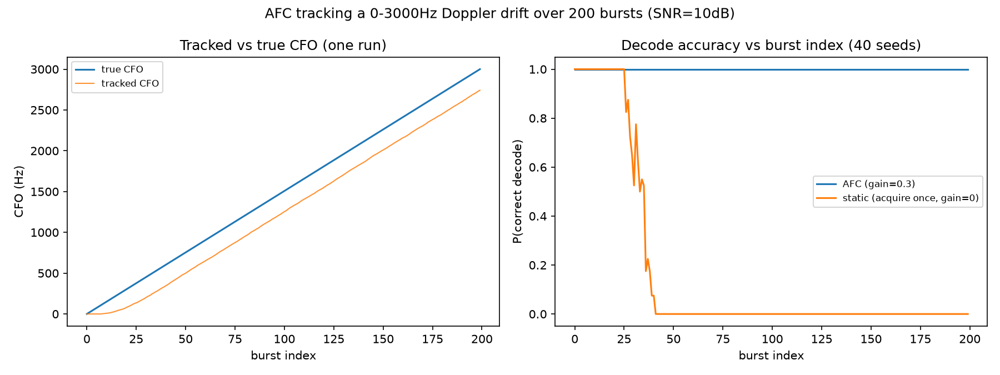

### 6.4 Pushing on it: a smarter tracker, and a Doppler that changes sign

Two questions worth asking about a result like this rather than just
accepting it: is the tracking loop itself as good as it can reasonably be,
and does it hold up outside the one scenario it was demonstrated on? A
satellite pass drifts the CFO in roughly one direction for the length of a
burst sequence. A low-altitude UAV or drone passing near the receiver
doesn't — it approaches (positive Doppler), crosses closest approach
(Doppler through zero), then recedes (negative Doppler), all within the
same pass.

On the tracker itself: the exponential loop filter above only ever chases
the latest measurement by a fixed fraction $\gamma$, which is exactly why
it has that steady-state lag under a constant drift. A Kalman filter that
tracks CFO *and* its rate jointly, predicting forward with the rate
estimate every burst instead of only reacting to where the CFO already is,
is the textbook fix for a lag like that — and it's also the standard
approach in the carrier-tracking literature more broadly, used for exactly
this kind of problem in GPS receivers and coherent optical communication
links. Tested directly against the same drift as above:

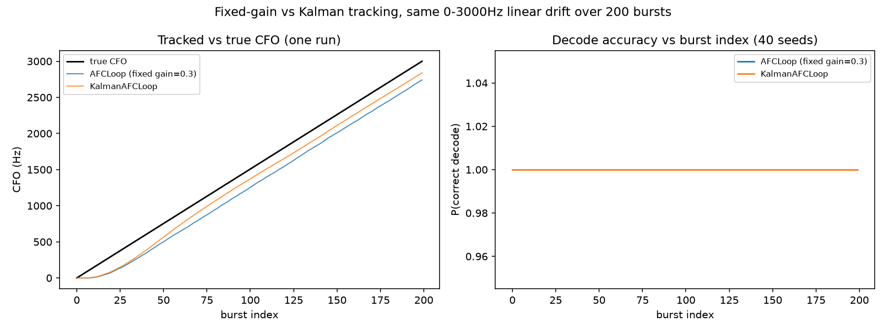

A real but modest improvement, not a dramatic one — the exponential filter
was already reasonably well-suited to a smooth, roughly-constant drift.
Where the two trackers actually diverge is on the harder question: what
happens when the drift itself reverses?

Modeling a UAV flyover honestly takes the standard constant-velocity
closest-point-of-approach Doppler curve — an S-curve that saturates to
$\pm f_{d,\max}$ far from the pass and crosses zero smoothly at closest
approach, steeper for a faster or lower pass:

$$
f_d(t) = -f_{d,\max} \cdot \frac{t}{\sqrt{t^2 + t_0^2}}
$$

Running that through the same two-edge measurement this chapter has used
throughout — the instantaneous rate of change near the start and the end
of each burst, exactly the "check both ends of the swept bandwidth"
approach this whole tracking idea started from — turned up something
worth being honest about: the very first version of this test, run over a
long sequence, diverged completely partway through, and not near the sign
reversal. Testing it down to the individual measurement found why:
`dual_edge_cfo_estimate`'s own quality check occasionally — about 1 in
400, measured directly — lets through a measurement that's wrong by
1-4.5 kHz while still reporting a passing score. Over a couple hundred
bursts that's unlikely to come up; over a few thousand (any realistic
pass) it's close to certain to happen at least once, and without a second
line of defense, one bad measurement was enough to permanently derail the
loop for the rest of the run — the next decode fails because the residual
now exceeds the decoder's own capture range, that failure corrupts the
next measurement too, and there was nothing to break the cycle. Both
trackers now gate outlier measurements before trusting them (`afc.py`'s
`AFCLoop.max_jump_hz` and `KalmanAFCLoop.innovation_gate`), which fixes it
directly. With that fix in place:

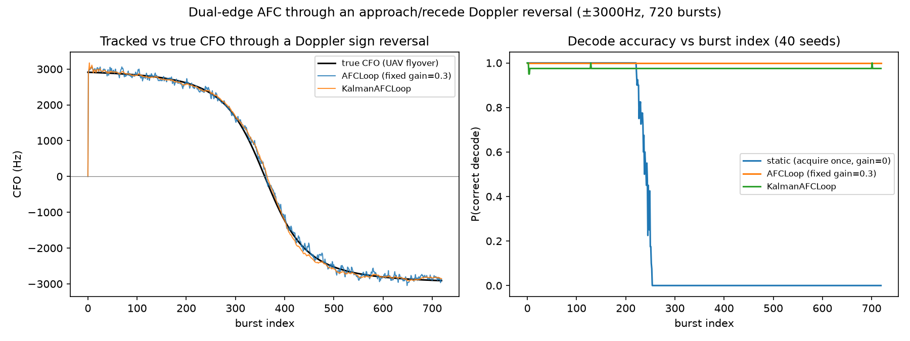

Both trackers follow the reversal cleanly from one side to the other,
while a receiver that only corrects once collapses the moment the drift
carries it away from wherever it first acquired. The same rate-of-change
measurement this project has used from the start does keep working
through a sign change, not just a monotonic ramp.

That still leaves a fair question: *how* fast a reversal can it follow? A
receiver correcting with its own latest estimate needs that estimate to
stay within the decoder's capture range every single burst — push the
reversal fast enough and that stops being true. Sweeping the steepness of
the flyover curve and plotting decode accuracy against the peak
instantaneous rate at the sign crossing finds the actual cliff rather than
guessing at one:

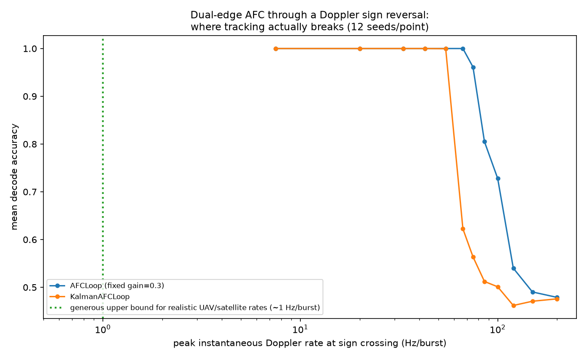

Both trackers hold accuracy near 1.0 up to roughly 55 Hz per burst and
collapse above roughly 100. At this configuration's symbol duration
(~1.02 ms), 55 Hz/burst works out to about 54 kHz/s of Doppler
*acceleration* — and real Doppler acceleration, for anything from a LEO
satellite pass to a fast low-altitude drone, runs orders of magnitude
below that. The cliff is real, found by testing rather than assumed away,
but it isn't close to being the binding constraint for either scenario
this chapter set out to check.

None of this is a coincidence specific to LoRa. The literature on
hyperbolic FM in sonar and radar has called it the "Doppler-tolerant"
waveform for decades, and it comes with the same tradeoff this project
found on its own in Chapter 5: Doppler insensitivity in the matched-filter
response arrives together with a time/range bias, not for free — see
Kroszczyński's original 1969 paper, and the more recent closed-form
treatment of that bias in Murray et al.'s "On the Doppler Bias of
Hyperbolic Frequency Modulation Matched Filter Time of Arrival Estimates"
(*IEEE Journal of Oceanic Engineering*, 2019). That bias is the same
underlying fact as Chapter 5's *lag*, showing up again under a different
name in a different field — which is a reasonable amount of independent
confirmation that HFM's Doppler behavior here isn't an artifact of this
project's specific simulation.

---

## Where to go from here

- `PAPER.md` — the same results with every proof given in full, organized
  as a dense reference rather than a narrative.
- `DISSERTATION_OUTLINE.md` — how these results map onto a dissertation
  chapter structure.
- `README.md` — how to regenerate every figure referenced above.
